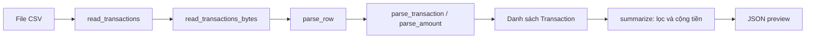

# Bài 02 — CSV, validation và nhãn khoản chi

Ngày chuẩn bị: 05/10/2026. Liên quan TASK-04; chuẩn bị kiến thức cho TASK-05. REQ-01, REQ-04, REQ-06, REQ-13. Bài này đã được soạn, chưa xác nhận bạn đã làm hoặc hiểu.

Code tham chiếu: [commit triển khai TASK-04](https://github.com/Krev1/spendwise-ai/tree/23c91b0995862a20327c7838ea162deabd3154fe). Chạy lệnh từ repo `spendwise-ai`; bài học và bài tập được lưu trong repo Learn.

## 1. Vấn đề cần giải quyết

Bạn ghi một khoản chi: ngày 05/10/2026, 45.000 đồng, ăn trưa. Nếu nhập `45.000` vào cột tiền, chương trình có nên tự đoán đó là 45 nghìn không? MVP chọn một hợp đồng rõ ràng: số tiền là chữ số nguyên dương, ví dụ `45000`. Input khác hợp đồng phải sửa trước khi tính tiền.

Đầu vào hôm nay là CSV. Đầu ra là các giao dịch đã kiểm tra và báo cáo **xem trước**. Chương trình chưa lưu database, chưa chạy mô hình AI và chưa chứng minh người dùng đã xác nhận category.

## 2. Ôn Python bằng một ví dụ nhỏ

```python
amount_text = "45000"   # str: dữ liệu chữ từ CSV
amount_vnd = int(amount_text)  # int: dữ liệu để tính tiền
print(amount_vnd + 10000)
```

`str` là chuỗi, `int` là số nguyên. `"45000" + "10000"` nối chữ thành `"4500010000"`; `45000 + 10000` cộng thành `55000`. Chuyển kiểu là cần thiết, nhưng `int()` một mình chưa kiểm tra mọi quy tắc nghiệp vụ: `int("-45000")` vẫn trả số âm trong khi MVP từ chối khoản tiền âm.

Một `dict` ghép tên trường với giá trị:

```python
row = {"amount_vnd": "45000", "description": "Ăn trưa"}
print(row["amount_vnd"])
```

Ví dụ dict này chỉ minh họa truy cập trường; validator thực tế yêu cầu đủ sáu trường. Một `list` chứa nhiều giao dịch. Một hàm nhận input và `return` output. Exception báo rằng input không thể xử lý theo hợp đồng; CLI bắt `ValidationError` và hiển thị thông báo để bạn sửa.

## 3. Đọc đúng sáu cột

```csv
transaction_id,date,transaction_type,amount_vnd,description,category
practice_01,2026-10-05,expense,45000,Ăn trưa,an_uong
```

| Cột | Quy tắc | Điều cần hiểu |
|---|---|---|
| transaction_id | 1–64 ký tự ASCII: chữ, số, `_`, `-` | Phân biệt giao dịch, không đổi ID mỗi lần nhập lại |
| date | Ngày tồn tại, dạng YYYY-MM-DD | `2026-02-30` đúng hình dạng nhưng không phải ngày hợp lệ |
| transaction_type | income hoặc expense | Thu/chi quyết định cách tổng hợp |
| amount_vnd | Số nguyên dương, tối đa 1.000.000.000.000 | Viết 45000, không viết 45.000 hay -45000 |
| description | 1–300 ký tự sau trim và chuẩn hóa NFC | Loại khoảng trắng đầu/cuối; thống nhất cách biểu diễn Unicode |
| category | Thu để trống; chi dùng một trong 8 nhãn hoặc trống khi preview | Có nhãn trong CSV chưa thay thế xác nhận khi lưu app |

CSV cần UTF-8; BOM ở đầu file được chấp nhận. Header phải đúng tên và thứ tự. Giới hạn là 5.000 **bản ghi** và 2.000.000 **byte**, không phải 2 triệu ký tự. Chữ tiếng Việt có thể chiếm nhiều byte.

Mô tả chứa dấu phẩy phải đặt trong dấu nháy:

```csv
practice_02,2026-10-05,expense,45000,"Cơm, trà đá",an_uong
```

Dấu phẩy bên trong nháy là một phần mô tả. Vì thế không thể đọc CSV bằng `line.split(",")`. Một mô tả được quote có thể chứa newline; một bản ghi khi đó chiếm nhiều dòng vật lý.

## 4. Từ một file ví dụ thành các module

| File trong repo dự án | Trách nhiệm |
|---|---|
| [domain/transactions.py](https://github.com/Krev1/spendwise-ai/blob/23c91b0995862a20327c7838ea162deabd3154fe/src/spendwise/domain/transactions.py) | Kiểm tra trường, chuyển chữ thành ngày/số tiền, tạo đối tượng dữ liệu |
| [services/csv_reader.py](https://github.com/Krev1/spendwise-ai/blob/23c91b0995862a20327c7838ea162deabd3154fe/src/spendwise/services/csv_reader.py) | Đọc bytes/file, kiểm tra CSV, giới hạn và ID trùng trong batch |
| [services/reports.py](https://github.com/Krev1/spendwise-ai/blob/23c91b0995862a20327c7838ea162deabd3154fe/src/spendwise/services/reports.py) | Lọc tháng và tính tổng thu/chi bằng số nguyên |
| [cli.py](https://github.com/Krev1/spendwise-ai/blob/23c91b0995862a20327c7838ea162deabd3154fe/src/spendwise/cli.py) | Nhận tham số lệnh, gọi services, in JSON hoặc lỗi |
| [scripts/preview_transactions.py](https://github.com/Krev1/spendwise-ai/blob/23c91b0995862a20327c7838ea162deabd3154fe/scripts/preview_transactions.py) | Điểm chạy từ checkout |



Domain không mở file và không biết SQLite hay Streamlit. Sau này nhập tay và nhập CSV cùng gọi quy tắc này, giúp chúng không xử lý tiền khác nhau.

`Transaction` là một dataclass: cách viết gọn cho đối tượng chứa các trường dữ liệu. `frozen=True` ngăn gán lại trường của đối tượng đó; nó **không tự kiểm tra tính hợp lệ của input**. Vì thế code hiện tại tạo dữ liệu qua `parse_transaction`/`parse_row`.

`read_transactions_bytes` cho phép kiểm tra nội dung file upload mà không cần lưu file tạm. CLI hiện đọc từ đường dẫn, rồi dùng cùng parser bytes. Khi input sai, không trả danh sách thành công một phần.

`examples/csv_contract.py` nay là wrapper: giữ lệnh cũ nhưng gọi logic trong `src/`. Không có hai bộ quy tắc tiền độc lập.

## 5. Chạy và đối chiếu

Trong PowerShell, từ thư mục gốc `spendwise-ai`:

```powershell
.\.venv\Scripts\python.exe -B scripts/preview_transactions.py examples/transactions_sample.csv --month 2026-10
.\.venv\Scripts\python.exe -B -m pytest -q
```

Lần kiểm tra của người hướng dẫn: **50 tests passed, 11 subtests passed**. Test kiểm tra input và tổng hợp; đây không phải độ chính xác AI hoặc bằng chứng bạn đã hiểu bài.

CSV mẫu hư cấu cho tháng 10:

```json
{
  "rows": 9,
  "income_vnd": 5000000,
  "expense_vnd": 2593000,
  "net_vnd": 2407000,
  "pending_expense_categories": 1
}
```

`net_vnd = income_vnd - expense_vnd`: chênh lệch thu–chi trong kỳ, chưa phải số dư ngân hàng. Khoản chi thiếu nhãn vẫn góp vào tổng preview và nhóm `can_xac_nhan`.

Nếu số tiền ở dòng 2 là `12.5`, lỗi dự kiến nêu `Dòng 2` và `amount_vnd`; CLI trả exit code 1. Trong PowerShell, `$LASTEXITCODE` sau lệnh Python cho biết mã thoát. Đây là biến do PowerShell cung cấp, không cần tự gán.

## 6. CSV giao dịch khác dataset ML thế nào?

| | CSV giao dịch | Dataset nghiên cứu |
|---|---|---|
| Mục đích | Quản lý thu–chi và preview | Huấn luyện/đánh giá bộ phân loại mô tả |
| Trường | transaction_id,date,transaction_type,amount_vnd,description,category | record_id,description,label,group_id,source,is_synthetic |
| Tiền/ngày | Cần cho nghiệp vụ tài chính | Không dùng làm feature của bài toán văn bản này |
| Label | Category có thể còn trống khi preview | Nhãn do người gán và kiểm tra, không lấy dự đoán AI làm đáp án |
| Nguồn | Giao dịch nhập vào app | Nguồn, quyền dùng và nhóm cần được ghi để chia tập |

Tám nhãn đang đề xuất: `an_uong`, `di_chuyen`, `nha_o_hoa_don`, `hoc_tap`, `mua_sam`, `giai_tri`, `suc_khoe`, `khac`.

Ví dụ hư cấu: “ăn trưa cơm gà” phù hợp `an_uong`; “mua vở học tập” phù hợp `hoc_tap`. “mua đồ” thiếu ngữ cảnh: cần quy tắc gán nhãn và cách xử lý bất đồng. Không tự gọi mọi câu khó là `khac` rồi coi đó là đáp án chắc chắn.

Hướng dẫn nhãn và quy trình dữ liệu sẽ được cụ thể hóa ở TASK-05–06. File CSV mẫu hiện tại phục vụ test phần mềm, không trở thành dataset thật hoặc tập test AI đại diện chỉ vì có category.

## 7. Bài tập tự làm

Làm [bộ tình huống CSV](../exercises/02_csv_cases.md). Nếu chưa làm bài 01, ưu tiên [bài 01](01_python_and_money.md) trước; bài này vẫn có thể đọc để hiểu cách tổ chức code.

Đọc hàm `parse_amount`, ghi hai bước: kiểm tra ký tự và kiểm tra phạm vi. Sau đó tìm nơi parser bổ sung số dòng vào lỗi. Tự giải thích vì sao sai một dòng thì CLI chưa được in báo cáo thành công.

## 8. Câu hỏi để bạn tự trình bày

1. `"45000"` và `45000` khác nhau thế nào khi dùng dấu cộng?
2. Vì sao `int("-45000")` chạy được nhưng input đó vẫn sai hợp đồng?
3. Vì sao mô tả có dấu phẩy làm `split(",")` không đủ để đọc CSV?
4. Vì sao có category trong CSV chưa có nghĩa người dùng đã xác nhận lưu?
5. Tám nhãn khoản chi được định nghĩa ở đâu? Tại sao không chép riêng mỗi bộ cho UI và CSV?
6. Vì sao không báo macro-F1 từ 10 dòng CSV mẫu này?

Ghi câu trả lời bằng lời của bạn vào [nhật ký học](../progress.md). Giữ phần kết quả trống cho đến khi tự chạy.

## 9. Giới hạn và việc tiếp theo

Đã có domain, CSV parser và preview CLI. Chưa có SQLite/atomic import giữa nhiều lần chạy, màn hình xác nhận, dataset validator hoặc model. Giới hạn tài nguyên mới được thử với dữ liệu hư cấu; chưa có đo hiệu năng toàn ứng dụng.

Bước tiếp theo trong kế hoạch kỹ thuật: guideline nhãn và dataset validator. Bước học tiếp theo phụ thuộc vào bài tự làm/câu trả lời của bạn.
